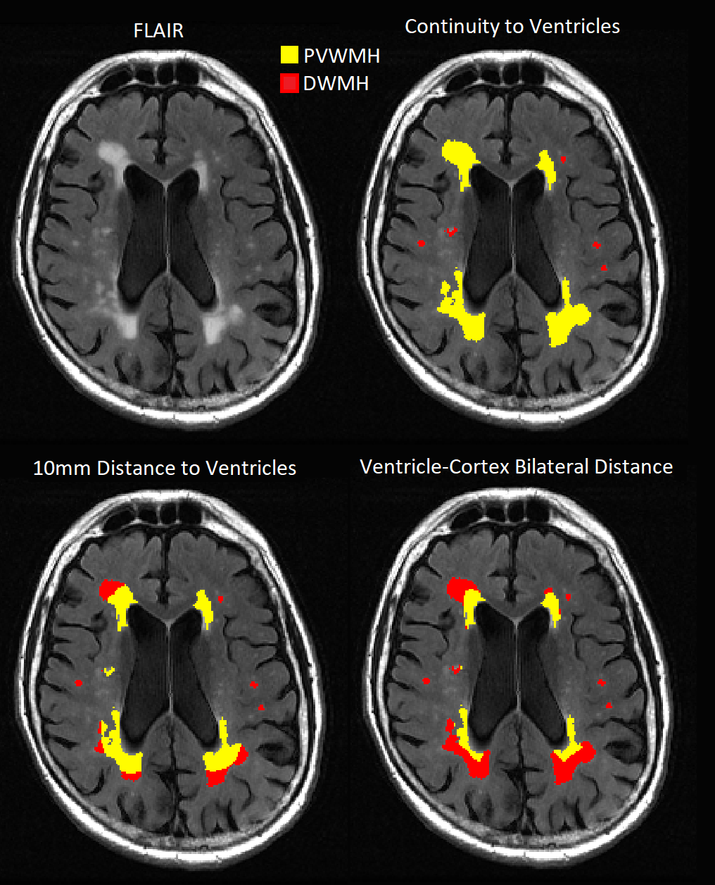

# WMHS Toolbox
## Automated subdivision of white matter hyperintensities
*by Jingyun (Josh) Chen at Neurology Dept, NYU School of Medicine*

Figure modified from [1].

## Main Function: wmhs_method()

Subdivide white matter hyperintensities (WMH) into Periventricular WMHs (PVWMHs), Deep WMHs (DWMHs), and (optional) Juxtaventricular WMHs (JVWMHs).

Usage: Out = wmhs_method(Mask_WMH,Mask_WM,Dmap_Vent,Dmap_Cort,Method)

### Inputs:
* Mask_WMH - binary mask of total WMHs.
* Mask_WM - birnary mask of total white matter.
* Dmap_Vent -  distance map to lateral ventricles.
* Dmap_Cort - distance map to cortex.
* Method -  Subdivision methods, must be one of following options:
   * "DM10" - Classic Dilation Mask (DM10) method classifies WMH voxels less than 10mm to ventricle walls as PVWMHs, and the rest as DWMHs [2].
   * "DM313" - Modified Dilation Mask (DM313) method classifies WMH voxels less than 3mm to ventricle walls as JVWMHs, between 3mm-13mm as PVWMHs, and the rest as DWMHs.
   * "CC" - Connected Component (CC) method classifies continued WMH clusters touching ventricle walls as PVWMHs, and the rest as DWMHs [2].
   * "BD" - Bilateral Distance (BD) method computes a WMH voxel’s closest distances to ventricle and to crebral cortex, 
          and classifies the voxel as PVWMH if it is closer to ventricle than to cortex, otherwise as DWMH [1].
 ### Output:
 * Out - mask of WMHs subdivisions, of same dimension as M.
   * Label values: 0 - Background; 1 - DWMHs; 2 - PVWMHs; 3 - JVWMHs (for "DM313" method only).

 ### Requirements:
 * Dimension must be same for all inputs masks and distance maps.  
 * Matlab Image Processing Toolbox must be installed for "CC" subdivision method.

## References

1.	J. Chen, A. Mikheev, H. Yu, M. D. Gruen, H. Rusinek, Y. Ge. Bilateral distance classification of periventricular and deep white matter hyperintensities with applications to mild cognitive impairment and Alzheimer’s disease study, Academic Radiology, 2020 (in press) https://doi.org/10.1016/j.acra.2020.07.039. 
2. Griffanti L, Jenkinson M, Suri S, Zsoldos E, Mahmood A, Filippini N, et al. Classification and characterization of periventricular and deep white matter hyperintensities on MRI: A study in older adults. NeuroImage. 2018;170:174-81. doi:https://doi.org/10.1016/j.neuroimage.2017.03.024.
